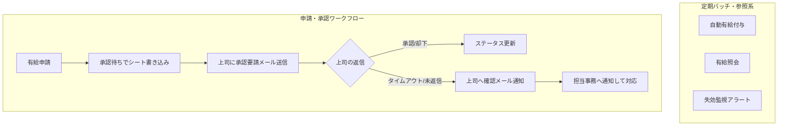

① タイトル ＆ 概要（キャッチコピー）
## 📊 システム構成図

ユーザーの申請アクションから承認、定期実行されるバッチ処理までの全体のデータフローとコンポーネントの関係性を表しています。

② 開発の背景・動機（なぜ作ったか）	
	
小規模な組織やアルバイト先などの現場において、有給休暇の管理が紙や属人的な運用になっているケースは少なくありません。私自身、実際に自身の有給残日数を確認しようとした際、「担当者に確認しないと分からない」「特定の権限者（事務局長など）しか把握できない」といった状況に直面し、確認コストの高さや不便さを痛感しました。

単なる照会機能だけでは実務の非効率（属人化した運用や確認コスト）の本質的な解決にならないため、申請から承認、失効監視までのエンドツーエンドの仕組みを一気通貫で構築しました。
	
書くべきこと:	
	
どのような課題や不便さを感じたか（例：「手動でのサーバー構築に時間がかかる」「環境差異によるトラブルを防ぎたい」など）
従業員が残り有給日数を確認できない状況、あるいは担当によって所要時間が異なるという俗人性を排除できるのではないかと考えた。

③ システム構成図 ＆ 使用技術
（※全体のデータフローは上部の「システム構成図」をご参照ください）

本システムは、小規模組織やコストを抑えたい環境を想定し、Google Workspaceの標準機能を最大限に活用して構築しています。

🛠️ 使用技術・ツール
バックエンド / ロジック: Google Apps Script (GAS)

データストア: Googleスプレッドシート（マスター管理・一時保存）

トリガー / 通知: Gmail（承認要請・タイムアウト時のエスカレーション通知）

運用自動化: GASの定期実行トリガー（自動有給付与・失効監視）

④ 主要機能
本システムは、有給管理における「申請・承認」「照会」「定期的な運用保守」の全プロセスをカバーしています。

インターフェースの一元化（Googleフォーム活用）

従業員からの「申請」「照会」だけでなく、上司側の「承認・却下」の返信プロセスに至るまで、すべてのユーザー操作をフォーム経由に一本化。一貫したシンプルなUXを実現。

1. 申請・承認ワークフロー（エンドツーエンド）

従業員からの申請を受け、スプレッドシートへの一時書き込みと上司への承認要請メールを自動送信。

上司の返信によるステータス更新（承認/却下）に加え、未返信時のタイムアウト検知・担当事務へのエスカレーション機能も実装。

2. 有給照会機能

従業員自身が、自身の現在の有給残日数や取得状況をいつでも確認できる仕組みを提供（確認コストの削減）。

3. 自動有給付与（定期バッチ）

勤続年数や法規に基づき、定期実行トリガーで有給休暇を自動付与。

4. 失効監視アラート（定期バッチ）

有効期限が迫っている有給や、法定要件（年5日の取得義務など）にかかるリスクを検知し、自動で監視・通知。

📝 ⑤ スクリプト・設定ファイルごとの詳細 ＆ 運用設計の工夫
1. スクリプト・処理ロジックの工夫点
有給取得IDのユニーク化（行数依存の脱却）

課題: 単純にスプレッドシートの行数でIDを生成すると、行の削除や並び替え、同時書き込み時に競合・重複するリスクがあった。

対応: タイムスタンプをベースにユニークなIDを生成する設計に変更し、データの固有性と一意性を担保。

承認プロセスの非同期・タイムアウト管理

課題: 単純な先入れ先出し（FIFO）計算や、上司の承認忘れによるプロセスの停滞。

対応: 承認工程を必ず挟むフローにし、さらに「承認処理が24時間以上経過した場合は自動でメール催促（およびステータス調整）」を行うエスカレーション機能を実装。

通知の最適化（アラート疲労の防止）

課題: 付与週次レポートなどを毎回すべて通知するとノイズになり、重要な見落としにつながる。

対応: 「エラーや要対応の検知時のみ通知する」仕様に絞り、運用のノイズを削減。

2. 入力インターフェースとデータ処理の設計
スプレッドシート直編集からフォーム運用への移行

課題: スプレッドシート上で直接申請・出力を行わせると、セル誤削除やフォーマット崩壊の危険がある。

対応: すべての入力・申請アクションを「Googleフォーム」経由に一本化し、不正なデータの混入や属人化を防止。

3. 業務運用・業務フロー（Runbook）の定義
システムだけでなく、現実の現場運用や例外ケースを見据えたルール設計も以下のように定義。

通常申請の基本ルール: 関係各所との事前調整のうえで申請（原則3日前まで）。

突発的なケース（体調不良など）の運用:

電話等で上司に口頭で伝えた上で、事後または直行でフォーム申請を行う。

上司側も実態に合わせてスムーズに承認フローを回せるような運用スキームにしている。

⑥ 今後の改善点・チャレンジしたいこと

内容: 現在のバージョンでは実装できていないが、今後追加したい機能や、さらに学びたい技術（CI/CDの高度化、監視・ログ収集の導入など）。

ポイント: 「作りっぱなしではなく、継続的に改善する意欲がある」ことを示せます。
運用ドキュメント（Runbook）の整備

現状の課題：自分以外の人がメンテナンスする際に手順が分かりにくい。

改善案：システムの初期設定手順や、トラブルシューティング時の対応手順（Runbook）をMarkdownで詳細にまとめ、誰が引き継いでも運用できるようにする。
