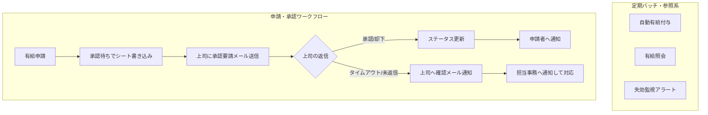

# 🌿 1.現場が自走する！Google Workspaceを活用した持続可能な有給管理システム
## 📊 システム構成図

ユーザーの申請アクションから承認、定期実行されるバッチ処理までの全体のデータフローとコンポーネントの関係性を表しています

---

## 💡 2. 開発の背景・動機（なぜ作ったか）

小規模な現場では、有給管理が属人化・アナログ化しているケース少なくありません。実際に自身の有給残日数を確認しようとした際、以下のような課題に直面しました。

* **情報の不透明さ:** 「担当者に確認しないと分からない」「特定の権限者しか把握できない」という状況による高い確認コスト。
* **属人化の弊害:** 従業員が自身の残り有給日数を確認できない状況や、担当者によって所要時間が異なる属人性の存在。

大掛かりなエンタープライズ向けSaaSや複雑なクラウドインフラ（AWS/GCPの本番構築など）は、小規模な現場の規模感やコスト面においてオーバースペックです。何より「現在の自身のスキルセットやリソースに合わせた現実的かつ持続可能な実装」を重視しました。過剰な仕組みを排し、日常使い慣れたツールで**「現場が自走して運用できる仕組み」**を構築しました。

---

## 🛠️ 3. 使用技術

過剰なインフラコストをかけず、小規模組織やコストを抑えたい環境でも堅牢に稼働することを想定しています。

* **バックエンド / ロジック:** Google Apps Script (GAS)
* **データストア:** Googleスプレッドシート（マスター管理・一時保存）
* **トリガー / 通知:** Gmail（承認要請・タイムアウト時のエスカレーション通知）
* **インターフェース:** Googleフォーム（申請・照会）
* **運用自動化:** GASの定期実行トリガー（自動有給付与・失効監視・タイムアウト検知）

---

## ⚙️ 4. 主要機能

有給管理における「申請・承認」「照会」「定期的な運用保守」の全プロセスをカバーしています。

1. **インターフェースの一元化**
   * 従業員からの「申請」「照会」から上司側の「承認・却下」に至るまで、すべてのユーザー操作をフォームおよびメール経由に一本化。
2. **申請・承認ワークフロー（エンドツーエンド）**
   * 申請を受けスプレッドシートへ一時書き込み後、上司へ承認要請メールを自動送信。未返信時のタイムアウト検知・担当事務へのエスカレーション機能も実装。
3. **有給照会機能**
   * 従業員自身が自身の残日数や取得状況をいつでも確認できる仕組みを提供し、確認コストを大幅削減。
4. **自動有給付与・失効監視（定期バッチ）**
   * 勤続年数や法規に基づく自動付与、有効期限や法定要件（年5日取得義務）にかかるリスクを自動検知・通知。

---

## 📝 5. 試行錯誤と設計の変遷（Development Story & Design Choices）

実際の開発・運用において直面した壁と、それをどのように乗り越えたかという設計の変遷です。

### ① データ構造の試行錯誤（スナップショットからトランザクションへ）
* **直面した壁:** 当初は失効期限別にデータを分けるため「状態保存用の列を2セット用意して管理する」アプローチを検討したが、「有給の失効ロジック」が完全に抜け落ちていることが発覚し、検証に約2週間を費やす。
* **設計の刷新:** 単なる静的なスナップショット管理から、時系列で履歴を正しく追える**「変形トランザクション設計」**へと刷新。

### ② インターフェースとデータ入力の刷新（属人性の排除）
* **課題:** スプレッドシート直接運用を想定していたが、確認コストやシートの直接編集によるフォーマット崩壊・誤操作リスクが発生。
* **アプローチ:** すべての入力を「Googleフォーム」へ一本化。さらに申請内容が控えとして手元に残るUXにブラッシュアップ。

### ③ 法的要件（時季変更権）を考慮した非同期承認フローの導入
* **課題:** 当初はFIFO（先入れ先出し）で即時書き込みを想定していたが、労働基準法における使用者の**「時季変更権」**を考慮し仕様変更。
* **仕様:** 一度「承認待ち」状態にして上司へ打診メールを送信。時季変更の場合は上司の「具体的な理由」と「避けてほしい期間」を部下に自動通知し、再調整が可能な仕様に。

### ④ 承認プロセスのタイムアウト・エスカレーション管理
* 申請から24時間以上経過しても承認がない場合、上司へ自動で催促しつつ、担当事務へも代替処理要請メールを行うエスカレーション機能を実装。

### ⑤ 失効・取得義務アラートの多段階実装
労働基準法の「年5日取得義務」や権利失効リスクを防ぐため、多段階のアラートを実装：
* **条件1（6か月前アラート）:** 期限6か月前で残日数 10日以上 の場合
* **条件2（1か月前アラート）:** 期限1か月前で残日数 5日以上 の場合
* **条件3（法定要件アラート）:** 「1年で5日以上の消化」を達成していない場合

### ⑥ 通知の最適化（アラート疲労の防止）
* **判断の転換:** 週次レポートの全件送信は人間の監視コストやノイズ（アラート疲労）につながるため、「平時は通知せず、エラーや要対応の検知時のみ即時通知する（**例外検知型**）」へ簡素化。

### ⑦ 【攻めの思想】有給照会プロセスのエンタメ化（ゲーミフィケーション）
* **思想の転換:** 単なる「守り（失効・ミス防止）」のシステムから、「いかに社員に積極的に休んでもらいリフレッシュしてもらうか」という**攻めのシステム**へ転換。
* **仕様:** 照会プロセスで過去の有給取得体験（おすすめの過ごし方など）を聞き取り、その回答を「有給照会の返信メール」にランダムで付記。結果的に事務処理がエンタメ化し、有給取得への心理的ハードルを軽減。

### ⑧ データ一意性の担保（行数依存の脱却）
* スプレッドシートの行数依存によるIDズレ・重複リスクを防ぐため、実行時の**「タイムスタンプ」ベースによる一意のID生成方式**に変更。

---

## 🚀 6. 今後の改善点・チャレンジしたいこと

持続可能な運用（Sustainable Ops）に向けて以下の改善を計画しています。

* **運用ドキュメント（Runbook）の整備:** 初期設定手順やトラブルシューティングをMarkdownで詳細にまとめ、誰が引き継いでも運用できるようにする。
* **監視・ログ収集の高度化:** エラー発生時のSlack/Chatwork連携によるリアルタイム通知の拡充や、実）。

ポイント: 「作りっぱなしではなく、継続的に改善する意欲がある」ことを示せます。
運用ドキュメント（Runbook）の整備

現状の課題：自分以外の人がメンテナンスする際に手順が分かりにくい。

改善案：システムの初期設定手順や、トラブルシューティング時の対応手順（Runbook）をMarkdownで詳細にまとめ、誰が引き継いでも運用できるようにする。
